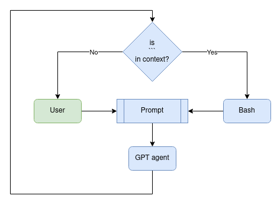

## Terminal gpt agent
Authonomous GPT agent can take commands from user and execute them on the remote machine by ssh.  
  
A multiple ssh calls from agent are available without interaction with user.
### Install sshd
```
sudo apt install openssh-server
sudo systemctl start sshd
```
### Test sshd
```
ssh localhost -p 2022
```
### Install repo
```
git clone https://github.com/format37/terminal.git
cd terminal
python3 -m pip install -r requirements.txt
```
### Test repo
```
python3 ssh.py
```
## Caution!
Your agent knows your login and password and can hurt your system!  
To hide the login and password, disable these lines:
```
system_text += f"\nuser login: {username}"
system_text += f"\nuser password: {password}"
```
### Run agent
Configure your agent in config.py  
Then run:
```
python3 agent.py
```