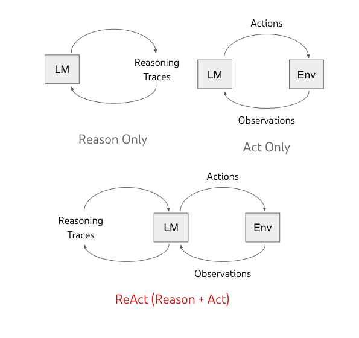
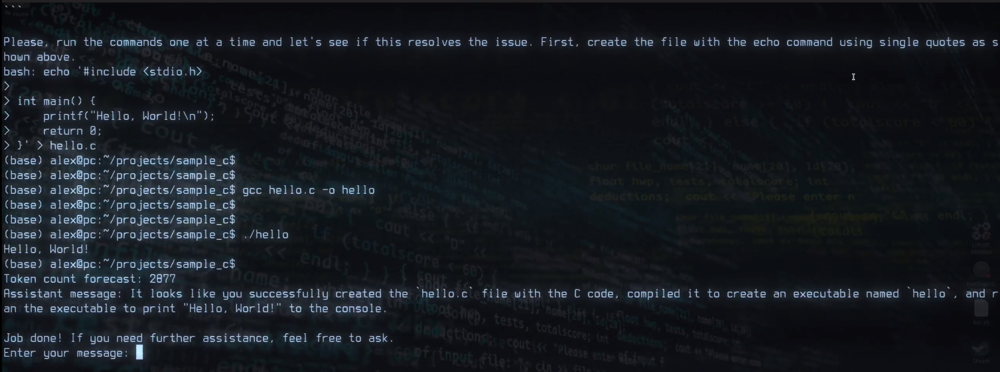

## Langchain ReAct agent
including tools:
* Shell (bash)
* DuckDuckGo Search
* Retrieval  
  
### Requirements
* Linux
* OpenAI api key
### Install repo
```
git clone https://github.com/format37/terminal.git
cd terminal
python3 -m pip install -r requirements.txt
```
### Run agent
Configure your agent in config.json  
Then run:
```
python3 agent.py
```
### Sample
[](https://youtu.be/n8_WRD7Ulg8?si=lAINq1mJ3ClhK4Vh)